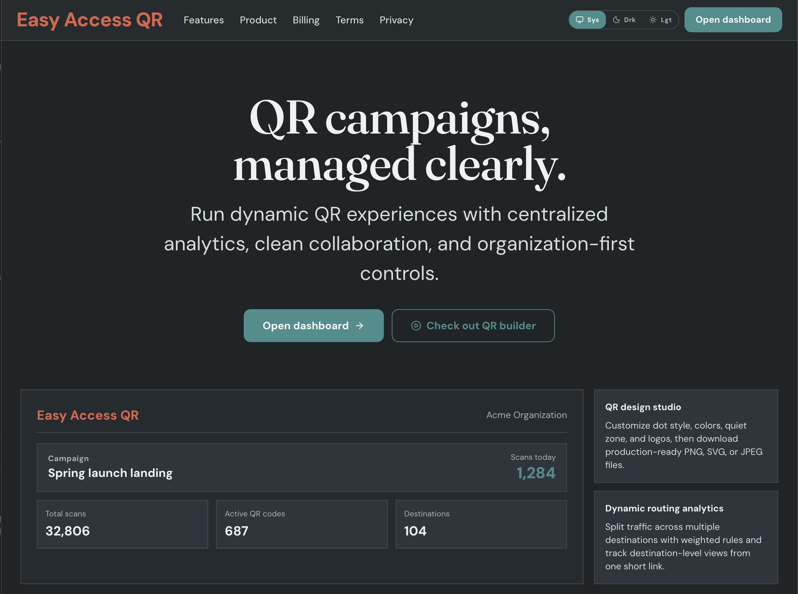

# Easy Access QR



Easy Access QR is an organization-first QR code platform for creating branded QR codes, routing traffic with weighted destinations, and tracking view analytics.

## Features

- Organization-scoped QR code management
- Dynamic short links (`/r/:organizationSlug/:qrSlug`) with scan/view tracking
- Weighted destination routing (A/B and multi-destination splits)
- QR design studio (styles, colors, logo support, export to PNG/SVG/JPEG)
- iPhone-safe QR constraints enforced in the builder
- Public QR pages for shareable, non-auth QR previews
- Analytics dashboards:
  - Total views, views today, active codes
  - Daily trend charts
  - Top codes and destination hit breakdowns
- Onboarding flow for new organizations
- People management and billing settings

## Current product status

- `API keys` is intentionally disabled in the app UI for now.
  - `/app/settings/api-keys` redirects to `/app/settings`
  - API key screens can be re-enabled later

## Tech stack

- TanStack Start + TanStack Router
- tRPC
- Drizzle ORM + PostgreSQL
- Better Auth
- Tailwind CSS + Radix UI primitives
- Bun runtime + toolchain

## Core data models

- `qr_code`
  - `organizationId`, `createdByUserId`
  - `name`, `slug`, `destinationUrl`
  - `destinations` (weighted routing rules)
  - `isActive`, `isPublic`
  - `scanCount`, `lastScannedAt`, timestamps
- `qr_scan_event`
  - `qrCodeId`, `organizationId`, `scannedAt`
  - destination attribution (`selectedDestinationId`, `selectedDestinationUrl`)
  - request metadata (`referrer`, `userAgent`, `ipHash`, `country`, `city`, `deviceType`)

## Local development

1. Install dependencies

```bash
bun install
```

2. Create env file

```bash
cp .env.example .env.local
```

3. Set required environment values in `.env.local`

- `DATABASE_URL` (for this app, typically `.../easyaccessqr`)
- `BETTER_AUTH_URL`
- `BETTER_AUTH_SECRET` (32+ chars recommended)

4. Prepare the database

```bash
bun run db:push
```

5. Seed development data (resets all public tables first)

```bash
bun run db:seed
```

Default seed users:

- `owner@easyaccessqr.com`
- `analyst@easyaccessqr.com`
- Password: `EasyAccessQR!123` (override with `SEED_PASSWORD`)

6. Start the app

```bash
bun run dev
```

## Scripts

- `bun run dev` - start local dev server
- `bun run build` - production build
- `bun run start` - run built server output
- `bun run lint` - Biome lint checks
- `bun run typecheck` - TypeScript type check
- `bun run test` / `bun run test:unit` - Vitest suite
- `bun run test:e2e` - Playwright suite
- `bun run db:generate` - generate Drizzle migrations
- `bun run db:migrate` - apply migrations
- `bun run db:push` - push schema to database
- `bun run db:seed` - reset and seed development data

## Public link behavior

- Hitting a short link (`/r/:org/:slug`) records a view and redirects to the selected destination.
- If a code is paused, a styled status page is shown.
- If a code is public, `?view=1` renders a public QR preview page without auth.

## Campaign toolkit release

The QR toolkit is available from workspace navigation at `/app/toolkit`.

1. **Wi-Fi QR codes** — personal network credentials, hidden networks, and open networks.
2. **Contact QR codes** — vCard 4.0 with name, company, phone, email, and website.
3. **Email QR codes** — recipient, subject, and prefilled message.
4. **SMS QR codes** — international number and prefilled message.
5. **Phone QR codes** — dialer links using international numbers.
6. **Map QR codes** — validated latitude and longitude, including zero coordinates.
7. **Text QR codes** — multiline and Unicode content.
8. **WhatsApp QR codes** — click-to-chat links with prefilled messages.
9. **Campaign URL builder** — source, medium, campaign, term, and content parameters.
10. **Tracking cleanup** — remove UTM and common advertising identifiers while retaining other query parameters and anchors.
11. **Printable QR cards** — custom heading and caption, with PNG/SVG downloads and a print layout.
12. **Bulk pause** — stop redirects for selected codes in one operation.
13. **Bulk resume** — reactivate codes with atomic plan-limit checks.
14. **Bulk visibility** — enable or disable public preview pages.
15. **Bulk tagging** — add or remove a tag, respecting the 12-tag limit.
16. **Bulk link copying** — copy selected tracked URLs, one per line.
17. **Visibility filtering** — find codes with public pages enabled or disabled.
18. **Routing filtering** — distinguish single destinations from weighted routing.
19. **Scan-activity filtering** — find codes that have never been scanned or already have scans.
20. **Library pagination** — 10, 25, or 50 codes per page with selection across pages.

Toolkit codes embed their content directly: they are not stored as managed codes,
are not editable after printing, and do not produce scan analytics. Network
passwords are included in Wi-Fi codes; share the resulting card appropriately.
Scanner support for contact and action formats depends on the scanning device.
Payload conventions follow [ZXing's barcode content documentation](https://github.com/zxing/zxing/wiki/Barcode-Contents)
and [vCard 4.0 (RFC 6350)](https://www.rfc-editor.org/rfc/rfc6350).

Batch writes affect at most 100 selected codes in the current organization. A
missing or unauthorized code, tag overflow, or activation-limit failure rolls
back the whole batch. Changing filters clears selection. Individual and batch
activation writes share an organization lock to protect plan limits under
concurrent requests. This release requires no database schema migration.
